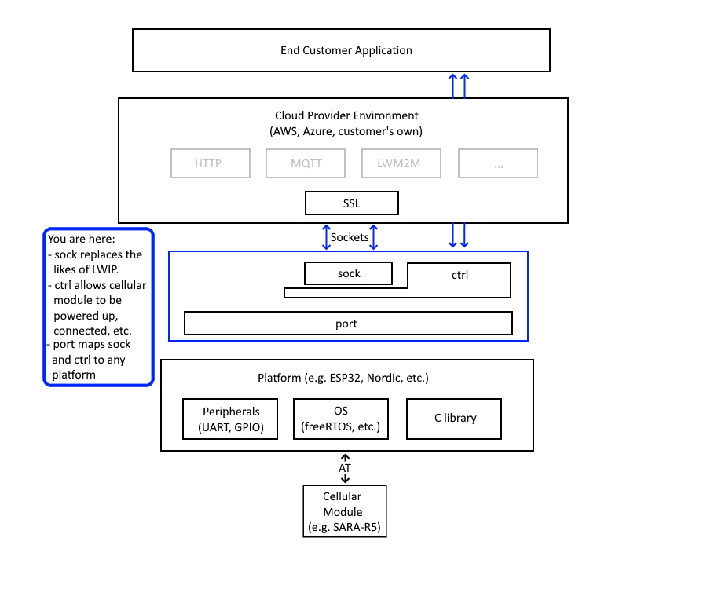

# Introduction
In this repository you will find the implementation of a cellular transport in C for various embedded target platforms, enabling a cellular connection to be used inside the embedded C IoT SDKs of cloud platforms such as AWS and Azure.  The implementation consists of:

- `ctrl`: a driver that allows control of a cellular module over an AT interface, e.g. make connection, read IMEI, read signal strength, etc.
- `sock`: a driver that allows data transfer through a cellular module, presenting the same TCP/UDP sockets API as LWIP and building on top of the AT parser in `ctrl`.
- `port`: the porting layer which allows `ctrl` and `sock` to be compiled and tested on various platforms and within various SDKs; look here for the build files and the tests.
- `cfg`: configuration information for the software in general, specific cellular modules and tests.

# Usage
The C API for `ctrl`, `sock` and `port` can be found in their respective `api` sub-directories and are documented in the header files there.  Information on how to build run tests on a given target platform can be found in the `README.md` files of the relevant platform sub-directory of `port`.

# License
The software in this repository is Apache 2.0 licensed.  The AT parsing code in `ctrl` is derived from the Apache 2.0 licensed AT parser of mbed-os; copyright (and our thanks) remain with the original authors.